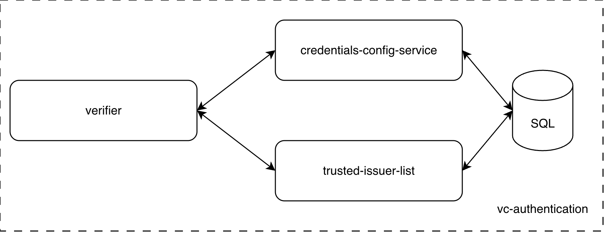
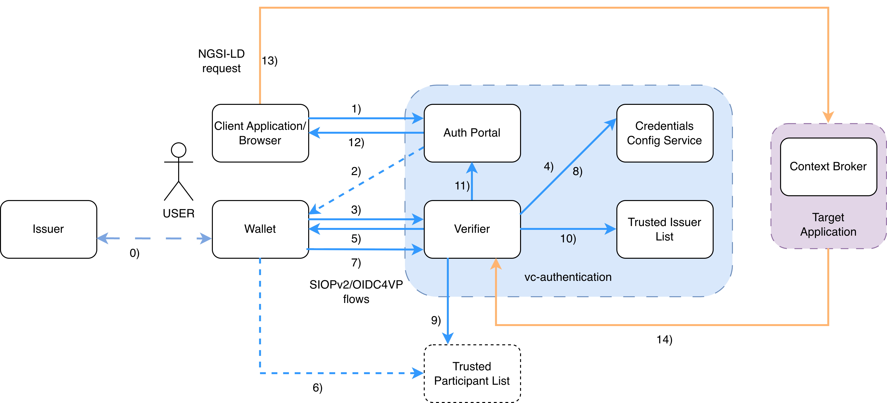
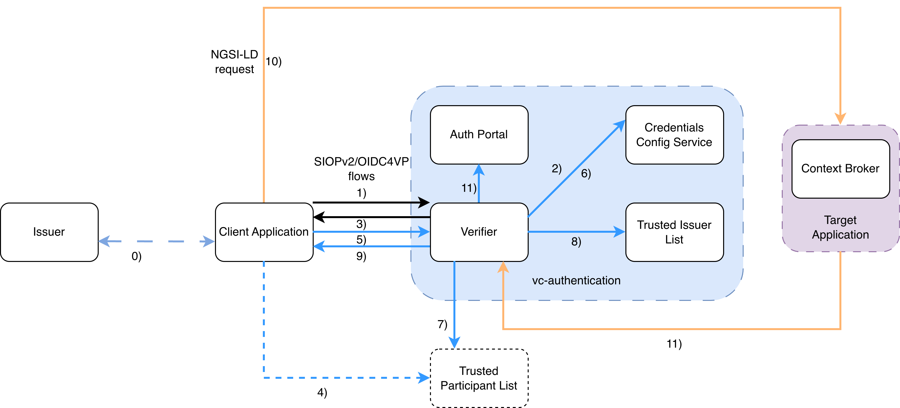

# vc-authentication

[](https://github.com/FIWARE/catalogue/tree/master/security/README.md)

The FIWARE Verifiable Credential Authentication (vc-authentication) is an integrated suite of components designed to facilitate authentication using Verifiable Credentials.

This repository provides a description of the FIWARE Verifiable Credential Authentication, its technical implementation and deployment recipes.

This project is part of [FIWARE](https://www.fiware.org/). For more information check the FIWARE Catalogue entry for
[Security](https://github.com/FIWARE/catalogue/tree/master/security).

| :books: [Documentation]()  |  :dart: [Roadmap](https://github.com/FIWARE/vc-authentication/tree/master/doc/ROADMAP.md)|
|---|---|

<details>
<summary><strong>Table of Contents</strong></summary>

<!-- START doctoc generated TOC please keep comment here to allow auto update -->
<!-- DON'T EDIT THIS SECTION, INSTEAD RE-RUN doctoc TO UPDATE -->
**Table of Contents**

- [Overview](#overview)
- [Release Information](#release-information)
- [Components](#components)
- [Description of flows in vc-authentication](#description-of-flows-in-vc-authentication)
  - [Registration](#registration)
  - [Authenticated access to a service](#authenticated-access-to-a-service)
    - [Human-To-Machine (H2M)](#human-to-machine-h2m)
    - [Machine-To-Machine (M2M)](#machine-to-machine-m2m)
- [Deployment](#deployment)
  - [Local Deployment](#local-deployment)
  - [Deployment with Helm](#deployment-with-helm)
- [Testing](#testing)
- [How to contribute](#how-to-contribute)
- [License](#license)

<!-- END doctoc generated TOC please keep comment here to allow auto update -->

</details>

## Overview
The FIWARE Verifiable Credential Authentication solution enables secure and decentralized authentication mechanisms by leveraging Verifiable Credentials (VCs). It allows users to authenticate themselves using cryptographic proofs, enhancing security and privacy in digital interactions. It allows to:
* Interface with Trust Services aligned with [EBSI specifications](https://api-pilot.ebsi.eu/docs/apis)
* Implement authentication based on [W3C DID](https://www.w3.org/TR/did-core/) with 
  [VC/VP standards](https://www.w3.org/TR/vc-data-model/) and 
  [SIOPv2](https://openid.net/specs/openid-connect-self-issued-v2-1_0.html#name-cross-device-self-issued-op) / 
  [OIDC4VP](https://openid.net/specs/openid-4-verifiable-presentations-1_0.html#request_scope) protocols

Technically, the FIWARE Verifiable Credential Authentication is a 
[Helm Umbrella-Chart](https://helm.sh/docs/howto/charts_tips_and_tricks/#complex-charts-with-many-dependencies), 
containing all the sub-charts and their dependencies for deployment via Helm.  
Thus, being provided as Helm chart, the FIWARE Verifiable Credential Authentication can be deployed on 
[Kubernetes](https://kubernetes.io/) environments.

## Release Information

The FIWARE Verifiable Credential Authentication uses a continious integration flow, where every merge to the main-branch triggers a new release. Versioning follows [Semantic Versioning 2.0.0](https://semver.org/lang/de/), therefor only major changes will contain breaking changes. 
Important releases will be listed below, with additional information linked:

## Components

The following diagram shows a logical overview of the different components of the FIWARE Verifiable Credential Authentication.



The main components of the FIWARE Verifiable Credential Authentication are:

| Component       | Role            | Link |
|-----------------|-----------------|------|
| VCVerifier      | Validates VCs and exchanges them for tokens | https://github.com/FIWARE/VCVerifier |
| credentials-config-service | Holds the information which VCs are required for accessing a service | https://github.com/FIWARE/credentials-config-service |
| trusted-issuers-list | Acts as Trusted Issuers List by providing an [EBSI Trusted Issuers Registry](https://api-pilot.ebsi.eu/docs/apis/trusted-issuers-registry) API | https://github.com/FIWARE/trusted-issuers-list |

**Note,** that the FIWARE Verifiable Credential Authentication does not include a Verifiable Credential Issuer nor a Verifiable Credential Wallet. Regarding the SQL database, any SQL database technology could be used theoretically, but it has been tested with both MySQL and PostgreSQL.

## Description of flows in vc-authentication

This section details the key interaction patterns and workflows within the FIWARE Verifiable Credential Authentication.

### Registration

For the vc-authentication component to ensure authenticated access for an organization, A registration process must take place beforehand:

* The organization requesting access must be pre-registered in the Trusted Issuer List as a trusted VC issuer.
* Optionally, it can also be registered in a Trusted Participant List, if configured.
* Additionally, the credential type(s) must be registered in the Credentials Config Service, specifying the Trusted Issuer List, the Trusted Participant List (optional), and the constraints associated with that credential type.


### Authenticated access to a service

After registration, a user belonging to the registered organization can perform authenticated access to a target service using VCs.

In the case of a user interacting with the service, this is a Human-To-Machine (H2M) interaction.

In the other case of an application interacting with the service, this is a Machine-To-Machine (M2M) interaction.

The following displays the different steps for the two different types of interactions

#### Human-To-Machine (H2M)



**Steps**

* A user (which belongs to the oganization that was issued a VC in step 0 that acredits him/her as user playing a relevant role) of the target service (i.e. Context Broker) request authentication 
  in the vc-authentication (steps 1-3 involving scanning of QR code using the wallet)
* The Verifier will request to the user (via his/her wallet) for VCs that acredit 
  1. the user owns credentials connected to roles meaningful for the given product/application and 
  2. some other VCs (steps 4-5). 
  Optionally, the wallet will check that the verifier belongs to a participant (step 6) and return the 
  requested VCs (step 7)
* Verifier verifies whether the VC was issued by an organization that 
  1. (optional) is a trusted participant of the data space (step 8) and 
  2. is a trusted issuer of the VCs meaningful for the application (that is, VCs only organizations that are registered can issue), also checks whether other VCs required were issued by trusted issuers (steps 9)
* If verifications were ok, it issues a token (step 10) that is transmitted to the user (step 11)
* Using the returned token, the user invokes the target application/service (Context Broker) (steps 12-13)
* The target service verifies the token's signature by obtaining the verifier's public key (step 14). If the token signature is valid, access is granted to the request


#### Machine-To-Machine (M2M)



* An application from the registered organization requests its authentication in the vc-authentication (steps 1)
* The Verifier will request to the application for VCs that acredit 
  1. the application owns credentials connected to roles meaningful for the given target service and 
  2. some other VCs (steps 2-3). 
  
  Optionally, the wallet will check that the verifier belongs to a trsuted participant (step 4) and 
  returns the requested VCs (step 5)
* The verifier checks in the Credentials Config Service the configuration for the given type of credentials (step 6)
* Optionally, the verifier verifies whether the VC was issued by an organization that is a trusted participant of the 
  (step 7) is a trusted issuer of the VCs meaningful for the application (that is, VCs that 
  only registered organizations can issue), also checks whether other VCs required were issued 
  by trusted issuers (steps 8)
* If verifications were ok, it issues a token that is transmitted to the application (steps 9)
* Using the returned token, the application invokes the target service (step 10)
* The target service verifies the token's signature by obtaining the verifier's public key (step 11). If the token signature is valid, access is granted to the request

## Deployment

### Local Deployment

The FIWARE Verifiable Credential Authentication provides a minimal local deployment setup intended for development and testing purposes.

The requirements for the local deployment are:
* [Maven](https://maven.apache.org/)
* Java Development Kit (at least v17)
* [Docker](https://www.docker.com/)
* [Helm](https://helm.sh/)
* [Helmfile](https://helmfile.readthedocs.io/en/latest/)

In order to interact with the system, the following tools are also helpful:
- [kubectl](https://kubernetes.io/docs/tasks/tools/install-kubectl/)
- [curl](https://curl.se/download.html)
- [jq](https://stedolan.github.io/jq/download/)
- [yq](https://mikefarah.gitbook.io/yq/)

> :warning: In current Linux installations, ```br_netfilter``` is disabled by default. That leads to networking issues inside the k3s cluster and will prevent the connector to start up properly. Make sure that its enabled via ```modprobe br_netfilter```. See [Stackoverflow](https://stackoverflow.com/questions/48148838/kube-dns-error-reply-from-unexpected-source/48151279#48151279) for more.

To start the deployment, just use:

```shell
    mvn clean deploy -Plocal
```

ToDo diagram of the deployment

### Deployment with Helm

The vc-authentication is a [Helm Umbrella-Chart](https://helm.sh/docs/howto/charts_tips_and_tricks/#complex-charts-with-many-dependencies), containing all the sub-charts of the different components and their dependencies. Its sources can be found 
[here](./charts/vc-authentication).

The chart is available at the repository ```https://fiware.github.io/vc-authentication/```. You can install it via:

```shell
    # add the repo
    helm repo add vc-authentication https://fiware.github.io/vc-authentication/
    # install the chart
    helm install <DeploymentName> vc-authentication/vc-authentication -n <Namespace> -f values.yaml
```
**Note,** that due to the app-of-apps structure of the deployment and the different dependencies between the components, a deployment without providing any configuration values will not work. Make sure to provide a 
`values.yaml` file for the deployment, specifying all necessary parameters. This includes setting parameters of the endpoints, DNS information (providing Ingress or OpenShift Route parameters), 
structure and type of the required VCs, internal hostnames of the different components and providing the configuration of the DID and keys/certs.

Configurations for all sub-charts (and sub-dependencies) can be managed through the top-level [values.yaml](./charts/vc-authentication/values.yaml) of the chart. It contains the default values of each component and additional parameter shared between the components. The configuration of the applications can be changed under the key ```<APPLICATION_NAME>```, please see the individual applications and there sub-charts for the available options.

The chart is [published and released](./github/workflows/release-helm.yaml) on each merge to master.

## Testing

In order to test the [helm-chart](./charts/vc-authentication) provided for the FIWARE Verifiable Credentials Authentication, an integration-test 
framework based on [Cucumber](https://cucumber.io/) and [Junit5](https://junit.org/junit5/) is provided: [it](./it).

The tests can be executed via: 
```shell
    mvn clean integration-test -Ptest
```
They will spin up the [Local Deployment](#local-deployment) and run 
the [test-scenarios](./it/src/test/resources/it/mvds_basic.feature) against it.

## How to contribute

Please, check the doc [here](doc/CONTRIBUTING.md).

## License
vc-authentication is licensed under [Apache 2.0 License](LICENSE).

For the avoidance of doubt, the owners of this software
wish to make a clarifying public statement as follows:

> Please note that software derived as a result of modifying the source code of this
> software in order to fix a bug or incorporate enhancements is considered a derivative 
> work of the product. Software that merely uses or aggregates (i.e. links to) an otherwise 
> unmodified version of existing software is not considered a derivative work, and therefore
> it does not need to be released as under the same license, or even released as open source.
